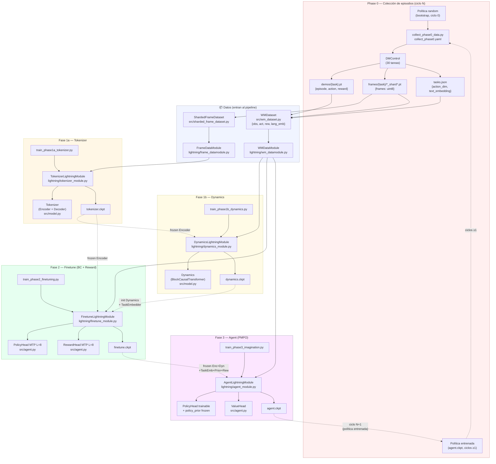
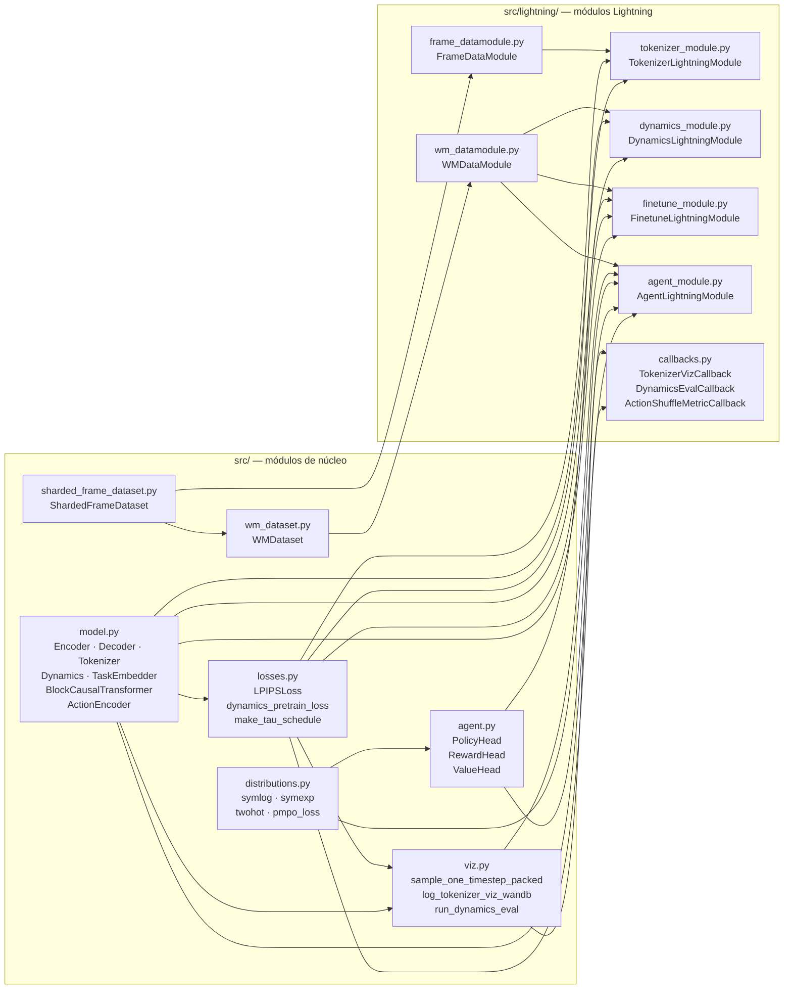
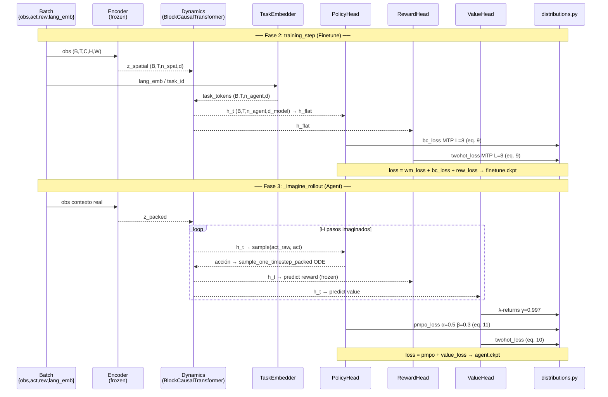

# dreamer4 — Arquitectura y flujo de entrenamiento

> Renderiza con VS Code + extensión `bierner.markdown-mermaid`, o pega los bloques en https://mermaid.live

---

## 1. Pipeline de entrenamiento (5 fases, ciclo recursivo)

---

## 2. Dependencias entre módulos

---

## 3. Flujo de datos interno — Fase 2 y Fase 3

